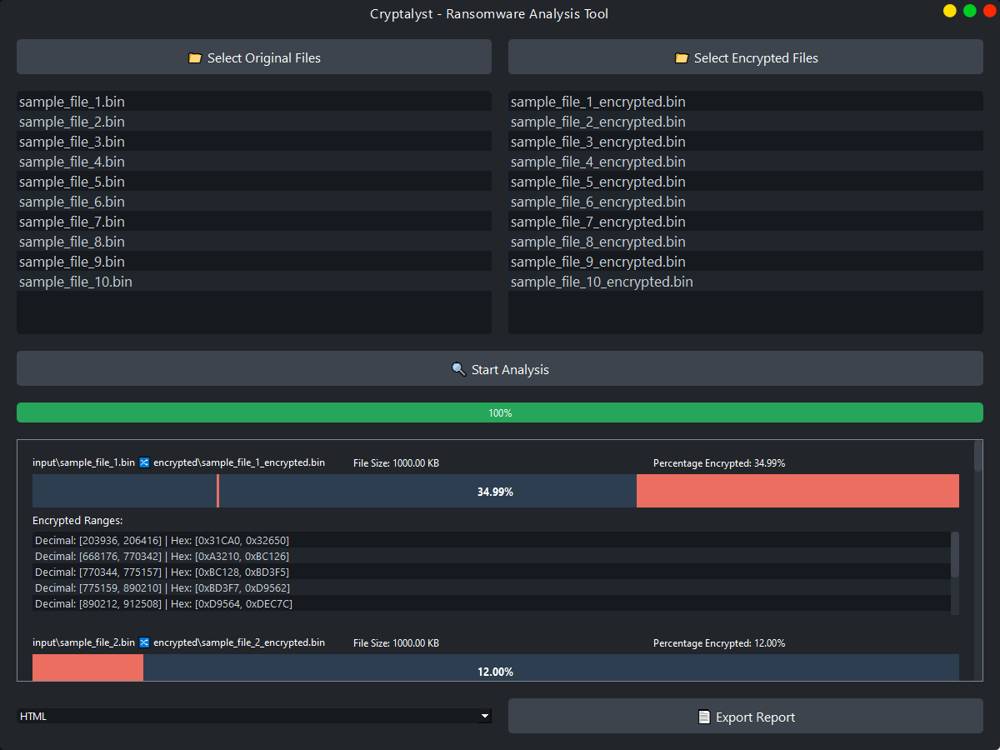

# Cryptalyst - Ransomware Analysis Tool

Cryptalyst is a user-friendly GUI application designed to assist in the analysis of ransomware-encrypted files. It provides a visual comparison between original and encrypted files, helping security researchers and analysts understand the encryption patterns and characteristics of various ransomware strains.


## How It Works

Cryptalyst requires two sets of files for effective analysis:

1. **Original Files**: These are unencrypted files from before the ransomware attack. They can be sourced from:
   - Backup drives or USB devices
   - Cloud storage backups
   - Any other location where pre-attack files were stored

2. **Encrypted Files**: These are the files that have been encrypted by the ransomware.

The tool compares these file pairs to identify the changes made by the ransomware, providing insights into its encryption patterns and behavior.

**Note**: It's essential to have access to original, unencrypted versions of the files to perform this analysis.
 If you don't have backups of any file from the system from before the ransomware attack, the tool is of no use. It's important to note that for the analysis to work, the original and encrypted versions of each file must be of the same size.


## Screenshot



This screenshot showcases the main interface of Cryptalyst, demonstrating its user-friendly design and key features:

1. File selection buttons for original and encrypted files
2. Analysis progress bar
3. Visual representation of file encryption patterns
4. Detailed byte range information
5. Export options for analysis results


## Features

- **File Comparison**: Easily compare original files with their encrypted counterparts.
- **Visual Representation**: Get a graphical view of encrypted portions within files.
- **Detailed Analysis**: View exact byte ranges affected by encryption.
- **Batch Processing**: Analyze multiple file pairs simultaneously.
- **Export Functionality**: Export results to HTML or JSON formats.

## Requirements

- Python 3.6+
- PyQt6

## Installation

1. Clone this repository:
   ```
   git clone https://github.com/yourusername/cryptalyst.git
   cd cryptalyst
   ```

2. Install the required dependencies:
   ```
   pip install -r requirements.txt
   ```

## Usage

1. Run the application:
   ```
   python main.py
   ```

2. Use the "Select Original Files" and "Select Encrypted Files" buttons to choose the files for analysis.

3. Click "Start Analysis" to begin the comparison process.

4. View the results in the application window, including visual representations and detailed encryption ranges.

5. Export the analysis report in HTML or JSON format using the "Export Report" button.

## Contributing

Contributions to Cryptalyst are welcome! Please feel free to submit pull requests, report bugs, or suggest new features.

## Disclaimer

Cryptalyst is intended for educational and research purposes only. Always handle potentially malicious files with caution and in a secure, isolated environment.
